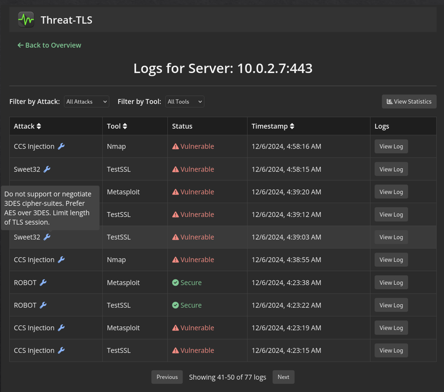

  <h1>Threat-TLS</h1>
  

    
    
    

    
  

  <h2>Overview</h2>
  
Threat-TLS is a network-based intrusion detection tool designed to identify weak, malicious, or suspicious TLS connections in intercepted traffic. By leveraging Suricata and Zeek IDS configured with custom rules, Threat-TLS detects TLS threat patterns associated with known vulnerabilities, such as outdated protocol versions, weak cryptographic algorithms, or malicious extensions. The tool validates detected threats using tools like Metasploit, Nmap, and TLS-Attacker, generating detailed reports for mitigation.

    
  

  <h2>Features</h2>
  <ul>
    <li>TLS Threat Detection: Identifies patterns in TLS connections that may indicate vulnerabilities or attacks.</li>
    <li>Custom IDS Rules: Configurable rules for Suricata and Zeek to detect specific TLS threats.</li>
    <li>Threat Validation: Verifies detected threats using tools like Metasploit and Nmap.</li>
    <li>Detailed Reporting: Provides comprehensive logs and actionable insights for mitigation.</li>
    <li>Experimental Testbed: Tested with vulnerable OpenSSL versions to validate detection and verification processes.</li>
  </ul>

  <h2>Installation</h2>
  
1. Clone the repository:

  

    <code>git clone https://github.com/lithekevin/Threat-TLS.git</code> 
    <code>cd threat-tls</code>
  

  
2. Set up the environment variable for the NVD API key:

  

    <code>export NVD_API_KEY=your_api_key</code>
  

  <h2>Usage</h2>
  <h3>Monitor Network Traffic</h3>
  
To start monitoring network traffic with Suricata or Zeek, run the following command:

  

    <code>python core.py --IDS=Suricata</code> 
or 
    <code>python core.py --IDS=Zeek</code>
  

  
Visualize the results in the web interface by opening the following URL in your browser:

  

    <code>http://localhost:5000</code>
  

<h3>Perform Specific Attack</h3>
  
To perform a specific attack on a host, use the following command:

  

    <code>python core.py --attack attack_name --host ip:port</code>
  

  
Replace <code>attack_name</code> with the name of the attack (e.g., heartbleed) and <code>ip:port</code> with the target host.

<h3>Whitelist Configuration</h3>
  
You can use a JSON configuration file to specify versions, ciphers, and certificate fingerprints that need to be whitelisted:

  

    <code>python core.py --json /path/to/config.json</code>
  

  <h2>Vulnerabilities</h2>
  
The tool checks for the following vulnerabilities:

  <ul>
    <li>BLEICHENBACHER: CVE-2012-0884</li>
    <li>CCSINJECTION: CVE-2014-0224</li>
    <li>POODLE: CVE-2014-3566</li>
    <li>HEARTBEAT EXTENSION: CVE-2014-0160</li>
    <li>LUCKY13: CVE-2013-0169</li>
    <li>PADDING ORACLE ATTACK: CVE-2016-2107</li>
    <li>SWEET32: CVE-2016-2183</li>
    <li>DROWN: CVE-2016-0800</li>
    <li>TICKETBLEED: CVE-2016-9244</li>
    <li>CRIME: CVE-2012-4929</li>
    <li>LOGJAM: CVE-2015-4000</li>
    <li>ROCA: CVE-2017-15361</li>
    <li>BEAST: CVE-2011-3389</li>
    <li>RC4: CVE-2013-2566</li>
    <li>FREAK: CVE-2015-0204</li>
  </ul>

  <h2>License</h2>
  
This project is licensed under the MIT License. See the LICENSE file for details.

